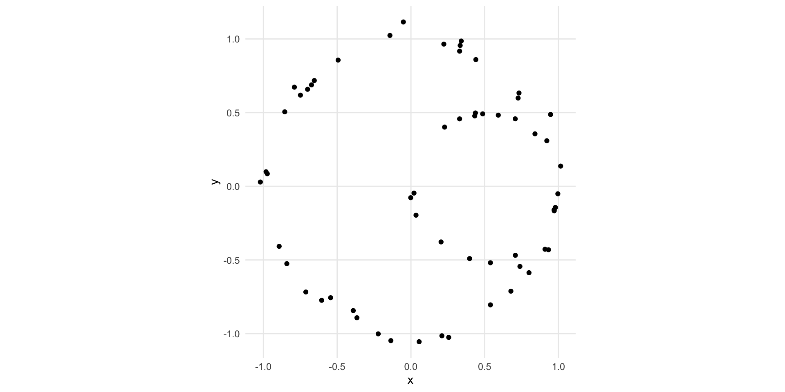
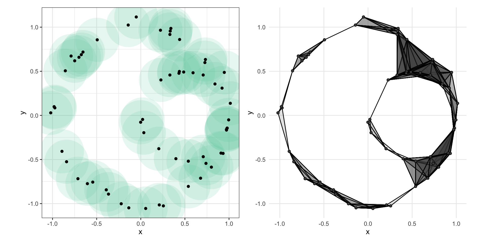
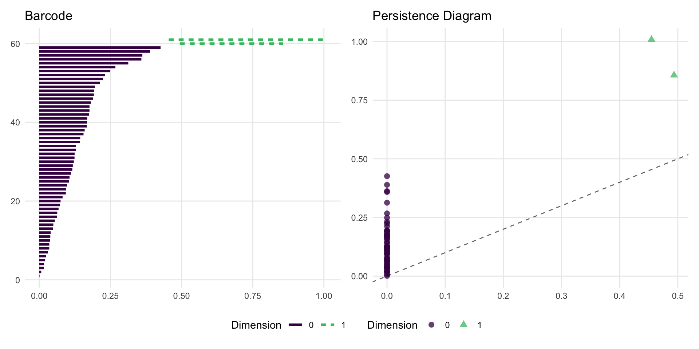
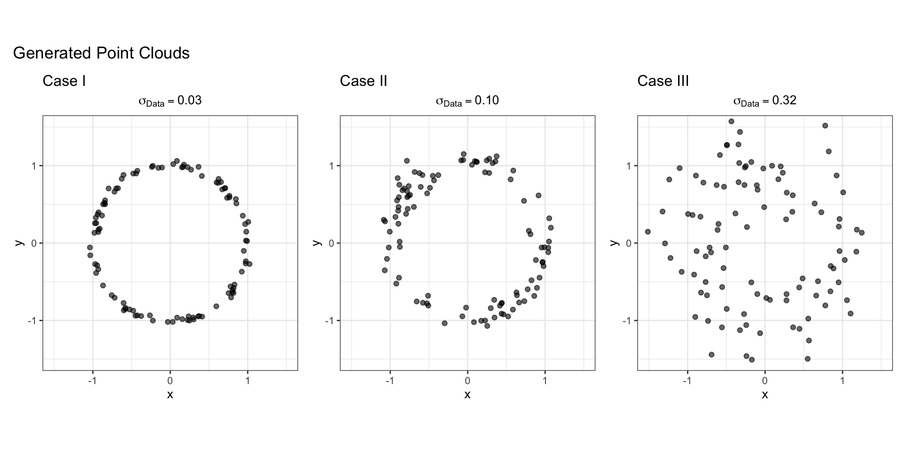
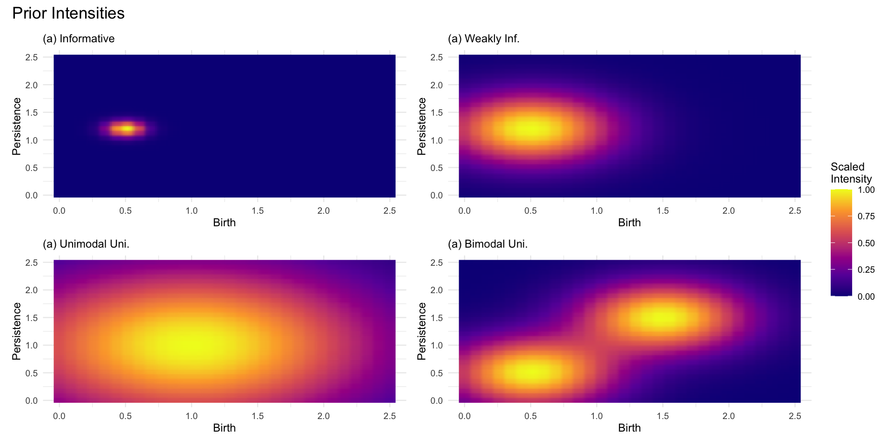
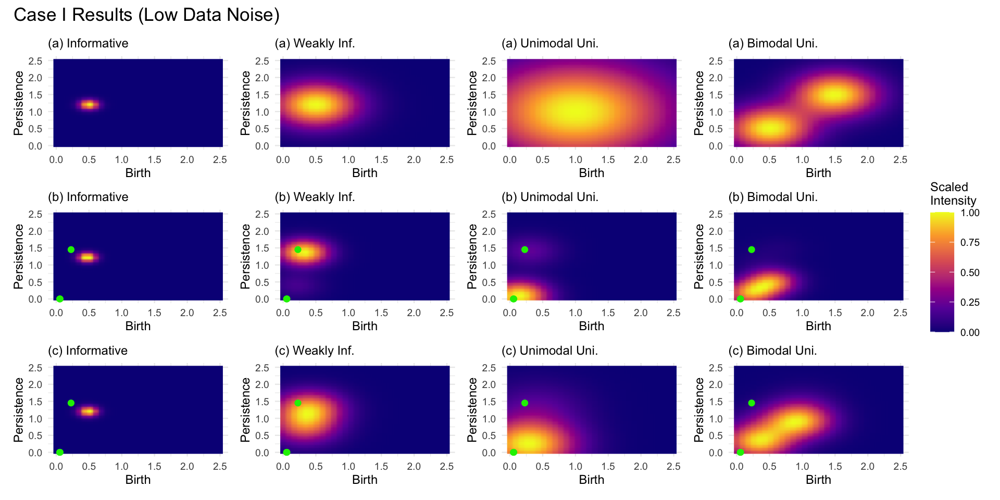
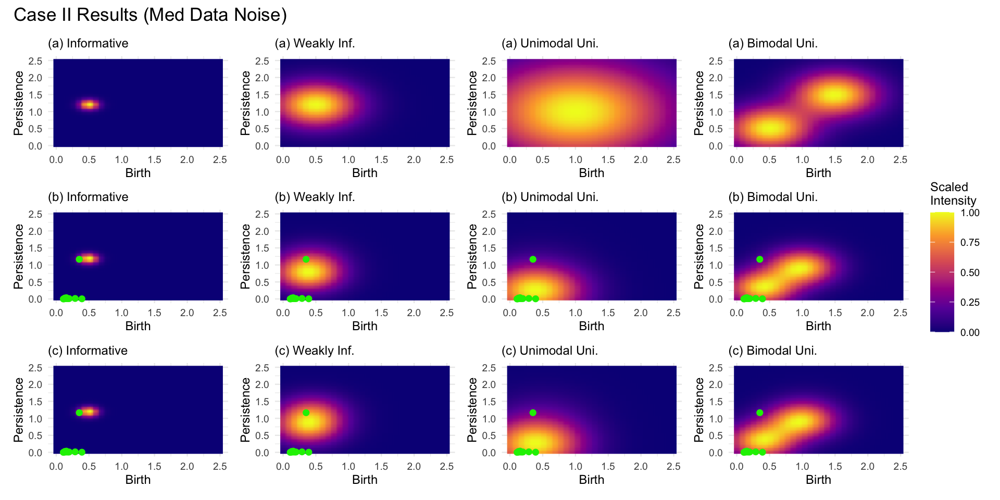
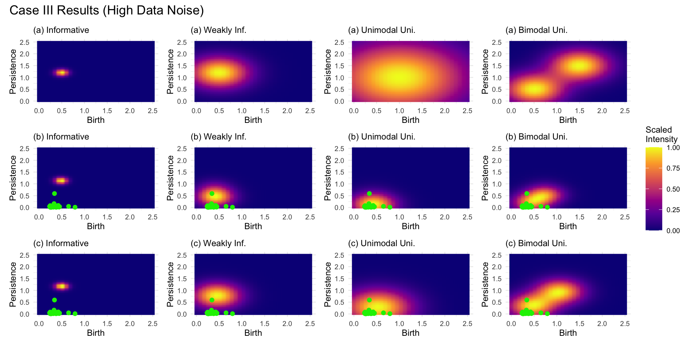
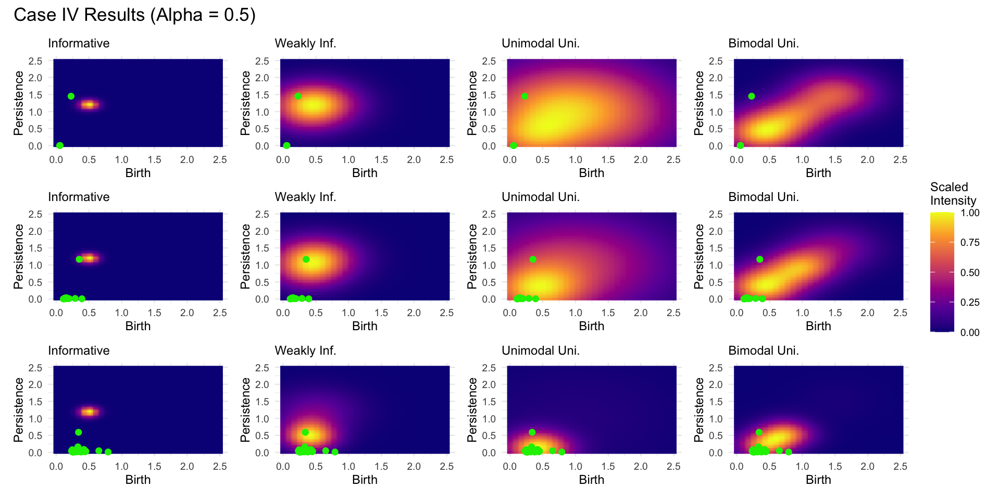

::: {.content-hidden}
$$


%%%%% normal, italicized greek symbol
%%%%%%%%%%%%%%%%%%%%%%%%%%%%%%%%%%%%%%%%%%%%%%%%%%%%%%%%%%%%

\newcommand{\al}{\alpha}
\newcommand{\be}{\beta}
\newcommand{\ga}{\gamma}
\newcommand{\de}{\delta}
\newcommand{\ep}{\epsilon}
\newcommand{\ze}{\zeta}
%eta
\renewcommand{\th}{\theta}
%iota
\newcommand{\ka}{\kappa}
\newcommand{\la}{\lambda}
%mu
%nu
%xi
%omicron
%pi
%rho
\newcommand{\si}{\sigma}
%tau
\newcommand{\up}{\upsilon}
%phi
%chi
%psi
\newcommand{\om}{\omega}

%Alpha
%Beta
\newcommand{\Ga}{\Gamma}
\newcommand{\De}{\Delta}
%Epsilon
%Zeta
%Eta
\newcommand{\Th}{\Theta}
%Iota
%Kappa
\newcommand{\La}{\Lambda}
%Mu
%Nu
%Xi
%Omicron
%Pi
%Rho
\newcommand{\Si}{\Sigma}
%Tau
%Upsilon
%Phi
%Chi
%Psi
\newcommand{\Om}{\Omega}


%%%%% macros with greek symbols
%%%%%%%%%%%%%%%%%%%%%%%%%%%%%%%%%%%%%%%%%%%%%%%%%%%%%%%%%%%%


\newcommand{\sisq}{\sigma^{2}}


%%%%% 
%%%%%%%%%%%%%%%%%%%%%%%%%%%%%%%%%%%%%%%%%%%%%%%%%%%%%%%%%%%%

%% Short-hand Code
\newcommand{\bs}[1]{\boldsymbol{#1}}
\newcommand{\f}[2]{\frac{#1}{#2}}
\renewcommand{\bar}{\overline}
\newcommand{\floor}[1]{\left\lfloor#1\right\rfloor}
\newcommand{\pa}{\partial}
\newcommand{\mc}[1]{\mathcal{#1}}
\newcommand{\mf}[1]{\mathfrak{#1}}

%% Statistical Stuff
\newcommand{\Indic}[2]{1_{#1}(#2)}
\newcommand{\E}[1]{\mathbb{E}\left[#1\right]}
\newcommand{\Ewrt}[2]{\mathbb{E}_{#1}\left[#2\right]}
\newcommand{\Var}[1]{\mathrm{Var}\left[#1\right]}
\newcommand{\Cov}[2]{\mathrm{Cov}\left[#1,#2\right]}
\newcommand{\CovVec}[1]{\mathrm{Cov}\left[#1\right]}
\newcommand{\Bern}[1]{\mathrm{Bernoulli}(#1)}
\newcommand{\Bin}[2]{\mathrm{Bin}(#1,#2)}
\newcommand{\NegBin}[2]{\mathrm{NegBin}(#1,#2)}
\newcommand{\Multinom}[1]{\mathrm{Multinom}(#1)} % manually input parameters, e.g. {n, p_{1}, p_{2}, p_{3}}
\newcommand{\Mult}[3]{\mathrm{Multinom}_{#1}(#2,#3)} % same as above, more generic, 
\newcommand{\Pois}[1]{\mathrm{Pois}(#1)}
\newcommand{\Unif}[2]{\mathrm{Unif}(#1,#2)}
\newcommand{\Norm}[2]{\mathcal{N}(#1,#2)}
\newcommand{\MVpNorm}[3]{\mathcal{N}_{#1}\left(#2,#3\right)}
\newcommand{\WDist}[3]{\mathcal{W}_{#1}\left(#2,#3\right)}
\newcommand{\ExpD}[1]{\mathrm{Exp}\left(#1\right)}
\newcommand{\BetaD}[2]{\mathrm{Beta}\left(#1, #2\right)}
\newcommand{\GammaD}[2]{\mathrm{Gamma}\left(#1, #2\right)}
\newcommand{\Weibull}{\mathrm{Weibull}}
\newcommand{\Rayleigh}{\mathrm{Rayleigh}}
\newcommand{\Maxwell}{\mathrm{Maxwell}}
\newcommand{\Logistic}{\mathrm{Logistic}}
\newcommand{\IG}{\mathrm{IG}}
\newcommand{\Gumbel}{\mathrm{Gumbel}}
\newcommand{\Cauchy}{\mathrm{Cauchy}}
\newcommand{\thetavec}{\underline{\theta}}
\newcommand{\etavec}{\underline{\eta}}
\newcommand{\PR}[1]{P\left(#1\right)}
\newcommand{\PRwrt}[2]{P_{#1}\left(#2\right)}
\newcommand{\PRRV}[1]{P\left[#1\right]}
\newcommand{\PRRVwrt}[2]{P_{#1}\left[#2\right]}
\newcommand{\sa}{\sigma\mathrm{-algebra}}
\newcommand{\disju}{\stackrel{\cdot}{\cup}}
\newcommand{\bigdisju}{\stackrel{\cdot}{\bigcup}}
\newcommand{\pisys}{\pi\mathrm{-system}}
\newcommand{\lamsys}{\lambda\mathrm{-system}}
\newcommand{\io}{\mathrm{ i.o. }}
\newcommand{\set}[1]{\left\{#1\right\}}
\newcommand{\oset}[1]{\left[#1\right]}
\newcommand{\tpl}[1]{\left(#1\right)}
\newcommand{\indep}{\ \underline{ \ \parallel } \ \ }
\newcommand{\nindep}{\ \underline{ \ \nparallel \ } \ \ }
\newcommand{\convas}{\stackrel{\mathrm{\scriptsize{a.s.}}}{\longrightarrow}}
\newcommand{\nconvas}{\stackrel{\mathrm{\scriptsize{a.s.}}}{\nrightarrow}}
\newcommand{\convip}[1]{\stackrel{\scriptsize{#1}}{\longrightarrow}}
\newcommand{\nconvip}[1]{\stackrel{\scriptsize{#1}}{\nrightarrow}}
\newcommand{\convlp}[1]{\stackrel{\scriptsize{L_{#1}}}{\longrightarrow}}
\newcommand{\nconvlp}[1]{\stackrel{\scriptsize{L_{#1}}}{\nrightarrow}}
\newcommand{\lpnorm}[2]{\left|\left|#2\right|\right|_{#1}}
\newcommand{\Far}{F^{\leftarrow}}
\newcommand{\convd}{\stackrel{\scriptsize{d}}{\longrightarrow}}
\newcommand{\nconvd}{\stackrel{\scriptsize{d}}{\nrightarrow}}
\newcommand{\eqd}{\stackrel{\scriptsize{d}}{=}}
\newcommand{\logit}{\mathrm{logit}}
\newcommand{\expit}{\mathrm{expit}}
\newcommand{\Func}[1]{{\tt #1}}

%% Mathematical Stuff
\newcommand{\C}{\mathbb{C}}
\newcommand{\R}{\mathbb{R}}
\newcommand{\Q}{\mathbb{Q}}
\newcommand{\N}{\mathbb{N}}
\newcommand{\Z}{\mathbb{Z}}
\renewcommand{\S}{\mathbb{S}}
% \renewcommand{\P}{\mathbb{P}}
\newcommand{\Cinf}{\mathbb{C}_{\infty}}
\newcommand{\CP}{\mathbb{CP}^{1}}
\newcommand{\RE}{\mathrm{Re}}
\newcommand{\IM}{\mathrm{Im}}
\newcommand{\Proj}[2]{\mathrm{Proj}_{#1}#2}
\newcommand{\pii}{\pi i}
\newcommand{\prp}{^{\perp}}
\renewcommand{\hat}{\widehat}
\renewcommand{\tilde}{\widetilde}
\newcommand{\st}{^\star}


%%  Type Setting Stuff
\newcommand{\eq}[1]{\begin{equation}#1\end{equation}}
\newcommand{\problem}[1]{\setcounter{equation}{0}\item \textbf{(#1)}}
\newcommand{\sureindent}{$\quad \quad$}
\newcommand{\comment}[1]{\quad \quad (\mathrm{#1})}
\renewcommand{\hbar}{\mathrm{------}}
\renewcommand{\complement}[1]{\bar{#1}}

%% Matrix and vector bolds 
\newcommand{\ma}[1]{\textbf{#1}}
\newcommand{\ve}[1]{\textbf{#1}}
\newcommand{\rve}[1]{\bm{#1}}
\newcommand{\norm}[1]{\left|\left|#1\right|\right|}
\newcommand{\specrad}[1]{\rho\left(\mathbf{#1}\right)}
\newcommand{\Cn}{\mathbb{C}^{n}}
\newcommand{\Cnn}{\mathbb{C}^{n \times n}}
\newcommand{\Cmn}{\mathbb{C}^{m \times n}}
\newcommand{\diag}{\mathrm{diag}}
\newcommand{\h}{^{*}} 
\renewcommand{\span}[1]{\mathrm{span}\left\{#1\right\}}
\newcommand{\spn}[1]{\overline{\mathrm{sp}}\left\{#1\right\}}
\newcommand{\pspc}{^{\perp}}
\newcommand{\I}{\mathbf{I}}
\newcommand{\tr}{\mathrm{tr} \ }
\renewcommand{\diag}{\mathrm{diag} \ }
\newcommand{\ip}[2]{\left\langle #1, #2\right\rangle}
\newcommand{\twovec}[2]{\left[\begin{matrix}#1 \\ #2 \end{matrix}\right]}
\newcommand{\twomat}[4]{\left[\begin{matrix}#1 & #3 \\ #2 & #4 \end{matrix}\right]}
\newcommand{\threevec}[3]{\left[\begin{matrix}#1 \\ #2 \\ #3\end{matrix}\right]}
\newcommand{\threemat}[9]{\left[\begin{matrix}#1 & #4 & #7 \\ #2 & #5 & #8 \\ #3 & #6 & #9\end{matrix}\right]}
\newcommand{\fourvec}[4]{\left[\begin{matrix}#1 \\ #2 \\ #3 \\ #4\end{matrix}\right]}
\renewcommand{\t}{^{\tau}}
\newcommand{\punc}[1]{#1^{*}}

%% number theory
\renewcommand{\mod}[2]{#1\,\mathrm{mod}\,#2}
\newcommand{\equivmod}[3]{#1\,=\,#2\,\mathrm{mod}\,#3}
\newcommand{\nequivmod}[3]{#1\,\neq\,#2\,\mathrm{mod}\,#3}
\newcommand{\divides}[2]{#1\,|\,#2}
\newcommand{\ndivides}[2]{#1\,\nmid\,#2}
\renewcommand{\gcd}[2]{(#1,\,#2)}
\newcommand{\divisors}[1]{\mc{D}_{#1}}


%% Other Stuff
\newcommand{\hdefn}[2]{{\color{notsobrightblue}\emph{\href{#1}{#2}}}}
\newcommand\independent{\protect\mathpalette{\protect\independenT}{\perp}}
\def\independenT#1#2{\mathrel{\rlap{$#1#2$}\mkern2mu{#1#2}}} 
\newcommand{\code}[1]{{\tt #1}}


%% colors
\renewcommand{\r}[1]{{\color{red}{#1}}}
\renewcommand{\b}[1]{{\color{blue}{#1}}}
\newcommand{\g}[1]{{\color{green}{#1}}}
\definecolor{BUgreen}{RGB}{24,144,41} % not official BU color
\definecolor{mmGreen}{RGB}{61,153,86} 
\definecolor{darkBlue}{RGB}{0,92,141} 
\newcommand{\db}[1]{{\color{darkBlue}{#1}}}
\newcommand{\mg}[1]{{\color{mmGreen}{#1}}}

\newcommand{\pl}[1]{{\fontfamily{\sfdefault}\selectfont #1}}
% \newcommand{\pkg}[1]{\textbf{\pl{#1}}}

\DeclareMathOperator*{\argmin}{\arg\!\min}
\DeclareMathOperator*{\argmax}{\arg\!\max}


$$
:::

# Contents

1.  [Introduction](#sec-intro)
1.  [Background](#sec-background)
1.  [Bayesian Framework](#sec-bayes)
1.  [Worked Example](#sec-example)
1.  [Classification](#sec-classification)
1.  [References](#sec-bib)


# Original Paper

A Bayesian Framework for Persistent Homology[@Maroulas2020-sp]


# Introduction {#sec-intro}


## Real World Problem

:::{.incremental}
- Motivation 
  - Detecting crystalline structures of materials HEAs(High Entropy Alloys)
:::

:::{.incremental}
- Current method APT(Atom Probe Tomography) 
    - 3D reconstruction of atoms
    - Drawbacks - experimental noise and abundance of missing data - 65% of atoms in a sample are not registered in typical experiment & spacial coordinates of atoms are corrupted by external noise. 
    - Existing algorithms rely on symmetry arguments and cannot establish crystal lattice
:::

## Real World Problem: Body Centered Cubic


::: {.cell layout-align="center"}
::: {.cell-output-display}

```{=html}
<div class="plotly html-widget html-fill-item" id="htmlwidget-9c709c265a22064a692a" style="width:960px;height:480px;"></div>
<script type="application/json" data-for="htmlwidget-9c709c265a22064a692a">{"x":{"visdat":{"ba86326437c3":["function () ","plotlyVisDat"],"ba865188fd0d":["function () ","data"],"ba86789d8a4c":["function () ","data"],"ba862ee2c171":["function () ","data"]},"cur_data":"ba862ee2c171","attrs":{"ba865188fd0d":{"alpha_stroke":1,"sizes":[10,100],"spans":[1,20],"x":{},"y":{},"z":{},"type":"scatter3d","mode":"markers","marker":{"color":{},"size":8,"line":{"color":"black","width":1}},"name":"Corner Atoms","inherit":true},"ba86789d8a4c":{"alpha_stroke":1,"sizes":[10,100],"spans":[1,20],"x":{},"y":{},"z":{},"type":"scatter3d","mode":"markers","marker":{"color":{},"size":10,"line":{"color":"black","width":1}},"name":"Center Atom","inherit":true},"ba862ee2c171":{"alpha_stroke":1,"sizes":[10,100],"spans":[1,20],"x":{},"y":{},"z":{},"type":"scatter3d","mode":"lines","line":{"color":"grey50","width":2},"name":"Edges","showlegend":false,"inherit":true}},"layout":{"margin":{"b":40,"l":60,"t":25,"r":10},"title":"BCC Structure","scene":{"xaxis":{"title":"X","range":[-0.20000000000000001,1.2],"showgrid":false,"zeroline":false,"showticklabels":false,"titlefont":{"size":12}},"yaxis":{"title":"Y","range":[-0.20000000000000001,1.2],"showgrid":false,"zeroline":false,"showticklabels":false,"titlefont":{"size":12}},"zaxis":{"title":"Z","range":[-0.20000000000000001,1.2],"showgrid":false,"zeroline":false,"showticklabels":false,"titlefont":{"size":12}},"aspectmode":"cube","camera":{"eye":{"x":1.5,"y":1.5,"z":1.5}}},"showlegend":false,"hovermode":"closest"},"source":"A","config":{"modeBarButtonsToAdd":["hoverclosest","hovercompare"],"showSendToCloud":false},"data":[{"x":[0,1,0,0,1,1,0,1],"y":[0,0,1,0,1,0,1,1],"z":[0,0,0,1,0,1,1,1],"type":"scatter3d","mode":"markers","marker":{"color":["green","orange","orange","beige","brown","beige","grey","blue"],"size":8,"line":{"color":"black","width":1}},"name":"Corner Atoms","error_y":{"color":"rgba(31,119,180,1)"},"error_x":{"color":"rgba(31,119,180,1)"},"line":{"color":"rgba(31,119,180,1)"},"frame":null},{"x":[0.5],"y":[0.5],"z":[0.5],"type":"scatter3d","mode":"markers","marker":{"color":"green","size":10,"line":{"color":"black","width":1}},"name":"Center Atom","error_y":{"color":"rgba(255,127,14,1)"},"error_x":{"color":"rgba(255,127,14,1)"},"line":{"color":"rgba(255,127,14,1)"},"frame":null},{"x":[0,1,null,0,0,null,0,0,null,1,1,null,1,0,null,0,0,null,0,0,null,1,1,null,1,0,null,1,1,null,1,0,null,1,1,null,0.5,0,null,0.5,1,null,0.5,0,null,0.5,0,null,0.5,1,null,0.5,1,null,0.5,0,null,0.5,1],"y":[0,0,null,0,1,null,0,0,null,1,0,null,1,1,null,1,0,null,1,1,null,0,0,null,0,0,null,1,1,null,1,1,null,1,0,null,0.5,0,null,0.5,0,null,0.5,1,null,0.5,0,null,0.5,1,null,0.5,0,null,0.5,1,null,0.5,1],"z":[0,0,null,0,0,null,0,1,null,0,0,null,0,0,null,1,1,null,1,0,null,1,0,null,1,1,null,1,0,null,1,1,null,1,1,null,0.5,0,null,0.5,0,null,0.5,0,null,0.5,1,null,0.5,0,null,0.5,1,null,0.5,1,null,0.5,1],"type":"scatter3d","mode":"lines","line":{"color":"grey50","width":2},"name":"Edges","showlegend":false,"marker":{"color":"rgba(44,160,44,1)","line":{"color":"rgba(44,160,44,1)"}},"error_y":{"color":"rgba(44,160,44,1)"},"error_x":{"color":"rgba(44,160,44,1)"},"frame":null}],"highlight":{"on":"plotly_click","persistent":false,"dynamic":false,"selectize":false,"opacityDim":0.20000000000000001,"selected":{"opacity":1},"debounce":0},"shinyEvents":["plotly_hover","plotly_click","plotly_selected","plotly_relayout","plotly_brushed","plotly_brushing","plotly_clickannotation","plotly_doubleclick","plotly_deselect","plotly_afterplot","plotly_sunburstclick"],"base_url":"https://plot.ly"},"evals":[],"jsHooks":[]}</script>
```

:::
:::


## Real World Problem: Face Centered Cubic


::: {.cell layout-align="center"}
::: {.cell-output-display}

```{=html}
<div class="plotly html-widget html-fill-item" id="htmlwidget-3e99a265d99815ce0897" style="width:960px;height:480px;"></div>
<script type="application/json" data-for="htmlwidget-3e99a265d99815ce0897">{"x":{"visdat":{"ba8663623d5e":["function () ","plotlyVisDat"],"ba8646ab194b":["function () ","data"],"ba86b09af2c":["function () ","data"]},"cur_data":"ba86b09af2c","attrs":{"ba8646ab194b":{"showlegend":false,"alpha_stroke":1,"sizes":[10,100],"spans":[1,20],"x":{},"y":{},"z":{},"type":"scatter3d","mode":"markers","marker":{"color":{},"size":10,"line":{"color":"black","width":1}},"hoverinfo":"text","text":{},"inherit":true},"ba86b09af2c":{"showlegend":false,"alpha_stroke":1,"sizes":[10,100],"spans":[1,20],"x":{},"y":{},"z":{},"type":"scatter3d","mode":"lines","line":{"color":"green","width":1.5},"name":"Edges","hoverinfo":"none","inherit":true}},"layout":{"margin":{"b":40,"l":60,"t":25,"r":10},"title":"FCC Structure","scene":{"xaxis":{"title":"X","range":[-0.20000000000000001,1.2],"showgrid":false,"zeroline":false,"showticklabels":false,"titlefont":{"size":12}},"yaxis":{"title":"Y","range":[-0.20000000000000001,1.2],"showgrid":false,"zeroline":false,"showticklabels":false,"titlefont":{"size":12}},"zaxis":{"title":"Z","range":[-0.20000000000000001,1.2],"showgrid":false,"zeroline":false,"showticklabels":false,"titlefont":{"size":12}},"aspectmode":"cube","camera":{"eye":{"x":1.5,"y":1.5,"z":1.5}}},"hovermode":"closest","showlegend":false},"source":"A","config":{"modeBarButtonsToAdd":["hoverclosest","hovercompare"],"showSendToCloud":false},"data":[{"showlegend":false,"x":[0,1,0,0,1,1,0,1,0.5,0.5,0,1,0.5,0.5],"y":[0,0,1,0,1,0,1,1,0.5,0,0.5,0.5,1,0.5],"z":[0,0,0,1,0,1,1,1,0,0.5,0.5,0.5,0.5,1],"type":"scatter3d","mode":"markers","marker":{"color":["beige","green","orange","brown","green","grey","blue","blue","beige","beige","orange","brown","orange","brown"],"size":10,"line":{"color":"black","width":1}},"hoverinfo":["text","text","text","text","text","text","text","text","text","text","text","text","text","text"],"text":["Type: corner <br>Coord: ( 0 , 0 , 0 )<br>Color: beige","Type: corner <br>Coord: ( 1 , 0 , 0 )<br>Color: green","Type: corner <br>Coord: ( 0 , 1 , 0 )<br>Color: orange","Type: corner <br>Coord: ( 0 , 0 , 1 )<br>Color: brown","Type: corner <br>Coord: ( 1 , 1 , 0 )<br>Color: green","Type: corner <br>Coord: ( 1 , 0 , 1 )<br>Color: grey","Type: corner <br>Coord: ( 0 , 1 , 1 )<br>Color: blue","Type: corner <br>Coord: ( 1 , 1 , 1 )<br>Color: blue","Type: face_center <br>Coord: ( 0.5 , 0.5 , 0 )<br>Color: beige","Type: face_center <br>Coord: ( 0.5 , 0 , 0.5 )<br>Color: beige","Type: face_center <br>Coord: ( 0 , 0.5 , 0.5 )<br>Color: orange","Type: face_center <br>Coord: ( 1 , 0.5 , 0.5 )<br>Color: brown","Type: face_center <br>Coord: ( 0.5 , 1 , 0.5 )<br>Color: orange","Type: face_center <br>Coord: ( 0.5 , 0.5 , 1 )<br>Color: brown"],"error_y":{"color":"rgba(31,119,180,1)"},"error_x":{"color":"rgba(31,119,180,1)"},"line":{"color":"rgba(31,119,180,1)"},"frame":null},{"showlegend":false,"x":[0,1,null,0,0,null,0,0,null,1,1,null,1,0,null,0,0,null,0,0,null,1,1,null,1,0,null,1,1,null,1,0,null,1,1,null,0.5,0,null,0.5,1,null,0.5,0,null,0.5,1,null,0.5,0,null,0.5,1,null,0.5,0,null,0.5,1,null,0,0,null,0,0,null,0,0,null,0,0,null,1,1,null,1,1,null,1,1,null,1,1,null,0.5,0,null,0.5,1,null,0.5,0,null,0.5,1,null,0.5,0,null,0.5,1,null,0.5,0,null,0.5,1],"y":[0,0,null,0,1,null,0,0,null,1,0,null,1,1,null,1,0,null,1,1,null,0,0,null,0,0,null,1,1,null,1,1,null,1,0,null,0.5,0,null,0.5,0,null,0.5,1,null,0.5,1,null,0,0,null,0,0,null,0,0,null,0,0,null,0.5,0,null,0.5,1,null,0.5,0,null,0.5,1,null,0.5,0,null,0.5,1,null,0.5,0,null,0.5,1,null,1,1,null,1,1,null,1,1,null,1,1,null,0.5,0,null,0.5,0,null,0.5,1,null,0.5,1],"z":[0,0,null,0,0,null,0,1,null,0,0,null,0,0,null,1,1,null,1,0,null,1,0,null,1,1,null,1,0,null,1,1,null,1,1,null,0,0,null,0,0,null,0,0,null,0,0,null,0.5,0,null,0.5,0,null,0.5,1,null,0.5,1,null,0.5,0,null,0.5,0,null,0.5,1,null,0.5,1,null,0.5,0,null,0.5,0,null,0.5,1,null,0.5,1,null,0.5,0,null,0.5,0,null,0.5,1,null,0.5,1,null,1,1,null,1,1,null,1,1,null,1,1],"type":"scatter3d","mode":"lines","line":{"color":"green","width":1.5},"name":"Edges","hoverinfo":["none","none",null,"none","none",null,"none","none",null,"none","none",null,"none","none",null,"none","none",null,"none","none",null,"none","none",null,"none","none",null,"none","none",null,"none","none",null,"none","none",null,"none","none",null,"none","none",null,"none","none",null,"none","none",null,"none","none",null,"none","none",null,"none","none",null,"none","none",null,"none","none",null,"none","none",null,"none","none",null,"none","none",null,"none","none",null,"none","none",null,"none","none",null,"none","none",null,"none","none",null,"none","none",null,"none","none",null,"none","none",null,"none","none",null,"none","none",null,"none","none",null,"none","none"],"marker":{"color":"rgba(255,127,14,1)","line":{"color":"rgba(255,127,14,1)"}},"error_y":{"color":"rgba(255,127,14,1)"},"error_x":{"color":"rgba(255,127,14,1)"},"frame":null}],"highlight":{"on":"plotly_click","persistent":false,"dynamic":false,"selectize":false,"opacityDim":0.20000000000000001,"selected":{"opacity":1},"debounce":0},"shinyEvents":["plotly_hover","plotly_click","plotly_selected","plotly_relayout","plotly_brushed","plotly_brushing","plotly_clickannotation","plotly_doubleclick","plotly_deselect","plotly_afterplot","plotly_sunburstclick"],"base_url":"https://plot.ly"},"evals":[],"jsHooks":[]}</script>
```

:::
:::


## TDA Motivation

:::{.incremental}
- Explore topological structure in datasets
    - Persistent homolgy, associate shapes to data & summarize  features with persistence diagrams
:::

:::{.incremental}
- Applicable to many areas
    - handwriting analysis, brain arteries, image analysis, neuroscience, sensor networks, protein structures, biology, dynamical systems, action recognition, signal analysis, chemistry, genetics, object data, etc.
:::

## TDA Motivation

:::{.fragment}
- Persistence Diagrams (PDs) for inference & classification problems
:::

:::{.incremental}
- Model PDs as random sets(not vectors) - Poisson point processes - single parameter intensity
    - Derive closed form of posterior - relies on conjugate families of Gaussian mixtures
:::

:::{.notes}
- compute posterior intensities w/o explicit maps between input diagram & underlying parameters
- Random vectors $X = \{X_1, \ldots, X_n\}$
- Random set - length not necessarily the same for each realization, and order doesn't matter
:::


# Background {#sec-background}

## Example Data


::: {.cell layout-align="center"}
::: {.cell-output-display}
{fig-align='center' width=960}
:::
:::


## Persistence Diagrams

Fundamental geometric structures

:::{.fragment}
* **Simplices:** Basic shapes like points, line segments, triangles, tetrahedra.
:::

:::{.fragment}
* **Simplicial Complexes:** Collections of simplices "glued" together in a structured way.
:::

## Simplices: Geometric Building Blocks {.smaller}

* A **$k$-simplex** is the convex hull of $k+1$ geometrically independent points (vertices) $\{v_0, ..., v_k\}$.
    * Notation: $[v_0, ..., v_k] = \bigl\{ \sum_{i=0}^k \alpha_i v_i : \sum_{i=0}^k \alpha_i = 1, \alpha_i \ge 0 \bigr\}$

::: {.incremental}
* **Examples:**
    * 0-simplex: $[v_0]$ (a point/vertex)
    * 1-simplex: $[v_0, v_1]$ (a line segment/edge)
    * 2-simplex: $[v_0, v_1, v_2]$ (a triangle, including interior)
    * 3-simplex: $[v_0, v_1, v_2, v_3]$ (a tetrahedron, including interior)
:::

:::{.fragment}
* **Faces:** k-1 simplices spanned by subsets of the vertices. (e.g., edges of a triangle).
:::

:::{.notes}
- $\alpha_i$ is weights/coefficients that sum to one, creates the hull/filled-in geometric object
- The convex hull is the smallest convex set that encloses all the points, forming a convex polygon
- "geometrically independent" means the points are affinely independent
- ex 3 points, not collinear
:::


## Simplicial Complexes

A **Simplicial Complex** $S$ is a collection of simplices satisfying:

:::{.fragment}
1.  **Face Inclusion:** If a simplex $\xi \in S$, then all faces of $\xi$ are also in $S$.
:::
:::{.incremental}
2.  **Consistent Intersection:** The intersection of any two simplices $\xi_1, \xi_2 \in S$ is either:
    * Empty ($\emptyset$), or
    * Contained in $S$
:::

:::{.fragment}
* **Intuition**: A well-constructed mesh made of points, edges, triangles, etc.
:::

## Example 

<!-- This is the simplicial complex generated by $r = .25$ -->


::: {.cell layout-align="center"}
::: {.cell-output-display}
{fig-align='center' width=960}
:::
:::


## Vietoris-Rips

:::{.incremental}
* **Goal:** Build a simplicial complex from a point cloud $X = \{x_i\}_{i=1}^L \subset \mathbb{R}^d$.
* **Vietoris-Rips Complex $\mathcal{V}_r(X)$:**
    * Parameter: Proximity radius $r > 0$.
    * Rule: A simplex $[x_{i_1}, ..., x_{i_l}] \in \mathcal{V}_r(X)$ iff $\text{diam} (x_{i_1}, ..., x_{i_l}) \leq r$
:::

:::{.fragment}
* **Intuition:** Connect groups of points that are close to each other.
:::

:::{.notes}
- $\text{diam}$ means the greatest distance between any 2 points
:::

## VR Filtration

:::{.fragment}
* Given a nondecreasing sequence $\{ r_n\}  \in  \mathbb{R}^+ \cup  \{ 0\}$  with $r_0 = 0$, we denote its Vietoris--Rips filtration by $\{ \mathcal{V}_{r_n} (X)\}_{ n\in \mathbb{N}}$ .
:::

:::{.fragment}
* A **Vietoris-Rips Filtration** is a sequence of nested simplicial complexes:
    $$ \mathcal{V}_{r_0}(X) \subseteq \mathcal{V}_{r_1}(X) \subseteq \mathcal{V}_{r_2}(X) \subseteq \dots $$
:::

:::{.fragment}
* As we increase the radius $r$, more points get connected, and higher-dimensional simplices appear.    
:::

:::{.fragment}
* This filtration tracks how the topological structure (connectivity, holes, voids) evolves as the scale $r$ changes.
:::

## VR Visualization


::: {.cell layout-align="center"}

:::


## Persistence Diagrams (PDs) {.smaller}

:::{.incremental}
* A Persistence Diagram (PD) $\mathcal{D}$ is a multiset of points in the space $\mathcal{W} = \mathbb{W} \times \{0, 1, ..., D-1\}$.
    * The **birth-death plane** is $\mathbb{W} = \{ (b, d) \in \mathbb{R}^2 \mid d \ge b \ge 0 \}$.
:::

:::{.incremental}
* Each point $(b, d, k) \in \mathcal{D}$ represents:
    * A homological feature of dimension $k$.
    * The feature appears (is **b**orn) at filtration scale $b$.
    * The feature disappears ( **d**ies) at filtration scale $d$.
:::


:::{.incremental}
* **Persistence:** $d-b$ (how long the feature "persists"). Longer persistence often indicates significant features.
* **Dimensions:**
    * $k=0$: Connected components.
    * $k=1$: Loops or holes.
    * $k=2$: Voids or cavities.
:::

:::{.notes}
A **Persistence Diagram** $\mathcal{D}$ summarizes the topological features found in a filtration.
- homological feature dim $k$ appears at $b$ and disappears at $d$
- dies when merges with another feature, ex loop dies when 'filled in' by triangles
- void - empty sphere, like a basketball
:::

## Persistence Diagrams


::: {.cell layout-align="center"}
::: {.cell-output-display}
{fig-align='center' width=960}
:::
:::


## The Poisson Point Process (PPP) {.smaller}

<!-- * **Goal:** Model random collections of points $\{x_1, \dots, x_n\}$ in a space $\mathbb{X}$ where order doesn't matter. *(Think of Persistence Diagrams as examples of such collections)*. -->

::: {.incremental}
* **General Idea:** Finite Point Processes $(\{p_n\}, \{\mathbb{P}_n\})$ model the *number* of points ($N \sim \{p_n\}$) and their *spatial distribution* ($(x_1, \dots, x_n) \sim \mathbb{P}_n$).
:::

::: {.incremental}
* **Poisson PP $\Pi$:** A specific, widely used PP governed by an **Intensity Measure $\Lambda$** on $\mathbb{X}$. Let $\mu = \Lambda(\mathbb{X})$.
    * **Cardinality ($N$):** The number of points $N \sim \text{Poisson}(\mu)$.
    * **Spatial Distribution ($\mathbb{P}_n$):** Given $N=n$ points, their locations are drawn **independently** from the normalized intensity measure $\frac{\Lambda(\cdot)}{\mu}$.
      $$ \mathbb{P}_n(A_1 \times \dots \times A_n) = \prod_{i=1}^n \left( \frac{\Lambda(A_i)}{\mu} \right) $$
:::

::: {.incremental}
* **Key Property:** The intensity $\Lambda(A)$ is the **expected number** of points falling within a region $A \in \mathcal{X}$:
    $$ \mathbb{E}[|\Pi \cap A|] = \Lambda(A) $$
:::

::: {.notes}
* $\mathbb{X}$ is polish space
* $\mathbb{P_n}$ symmetricy probablility measure on $X^n$ which is the Borel $\sigma$ algebra of $\mathbb{X}$
* **Why PPPs?** We're using PPPs because they provide a flexible framework for modeling point patterns like Persistence Diagrams, where both the *number* of points (topological features) and their *locations* (birth/death times) are random.
* **Intensity Measure $\Lambda$**: This is the core object defining a PPP.
    * It's a measure on the underlying space $\mathbb{X}$.
    * It controls *where* points are likely to appear. Regions $A$ with higher $\Lambda(A)$ are expected to contain more points.
    * Often, $\Lambda$ has a density $\lambda(x)$ (the intensity *function*), so $\Lambda(A) = \int_A \lambda(x) dx$. $\lambda(x)$ represents the "rate" or "density" of points near $x$.
    * The total intensity $\mu = \Lambda(\mathbb{X})$ is the *expected total number* of points in the process.
* **Cardinality:** Unlike a fixed dataset, the total number of points $N$ in a *realization* of a PPP is random, following a Poisson distribution with mean $\mu$.
* **Spatial Distribution:** This is crucial. For a *given* number of points $n$, the PPP places them *independently* of each other. The probability of a point landing in a region $A$ is proportional to $\Lambda(A)$. Knowing a point exists at $x$ gives no extra information about points nearby, beyond what $\Lambda$ already tells us.
* **Key Property:** This equation ($\mathbb{E}[|\Pi \cap A|] = \Lambda(A)$) directly connects the mathematical intensity measure $\Lambda$ to a tangible meaning: the average number of points you'd find in any region $A$. This justifies calling $\Lambda$ the "intensity".
:::

## Marked Poisson Point Processes {.smaller}

* **Motivation:** Model points $x \in \mathbb{X}$ that have associated attributes or 'marks' $m$ from another space $\mathbb{M}$. *(e.g., PD points $x$ with marks $m$ describing feature properties)*.

::: {.incremental}
* **Definition:** A Marked PPP $\Pi_M$ is a Point Process living on the product space $\mathbb{X} \times \mathbb{M}$.
:::

::: {.incremental}
* **Key Components & Properties:**
    * Relies on an underlying standard PPP on $\mathbb{X}$ (intensity $\Lambda$) to place the points $x$.
    * Uses a **Stochastic Kernel $\ell$**: For any fixed location $x \in \mathbb{X}$, $\ell(x, \cdot)$ is a **probability measure on the mark space $\mathbb{M}$**, defining the distribution $P(\text{mark } | \text{ location } x)$.
    * Given points $\{x_1, \dots, x_n\}$, their marks $\{m_1, \dots, m_n\}$ are generated **conditionally independently**, with $m_i$ drawn from the distribution $\ell(x_i, \cdot)$.
:::

::: {.notes}
* **Intuition:** Think of a two-stage process:
    1. Generate point locations $\{x_i\}$ in $\mathbb{X}$ using a standard PPP.
    2. For each generated point $x_i$, independently generate its mark $m_i$ using the probability distribution defined by the kernel $\ell(x_i, \bullet)$.
* $\mathbb{M}$ is the dimension of the birth death points
* **Stochastic Kernel $\ell$:** This is the crucial link. For each specific location $x$, $\ell(x, \bullet)$ *is* a complete probability measure defined over all possible marks in $\mathbb{M}$. It tells you the probability of getting any particular mark (or set of marks) given you are at location $x$. This means $\int_{\mathbb{M}} \ell(x, dm) = 1$.
* **Result:** The final output $\Pi_M$ is a collection of pairs $(x_i, m_i)$ living in the combined space $\mathbb{X} \times \mathbb{M}$.
* **Usefulness:** This structure allows modeling situations where point locations influence their properties, or where we might observe properties (marks) and want to infer locations (basis for later Bayesian section).
:::


# Bayesian Framework {#sec-bayes}

## Setting the Stage: Representation & Goal

:::{.fragment}
* **Tilted Representation:** We work with the "tilted" PD representation $(b, d-b)$ instead of $(b, d)$. This space is denoted $\mathbb{W}$. *(Notation Abuse: $\mathcal{D}$ is used for the tilted version $T(\mathcal{D})$).*
:::

:::{.fragment}
* **Focus:** We analyze one homological dimension $k$ at a time, assuming independence between dimensions (Model M1). *(Notation Abuse: We write $\mathcal{D}_X$ for $\mathcal{D}^k_X$)*
:::

:::{.fragment}
* **Goal:** Develop a Bayesian framework to update our belief about a "true" underlying (latent) PD, represented by a prior intensity $\lambda$, using one or more *observed* PDs $\mathcal{D}_Y$.
:::

::: {.notes}
* **Tilted Representation:** First, a quick coordinate change. Instead of birth ($b$) and death ($d$), we'll use birth ($b$) and persistence ($p = d-b$). This is just a linear transformation, often convenient for modeling. We denote the space of these $(b, p)$ points as $\mathbb{W}$. We'll often just write $\mathcal{D}$ when we mean the set of these tilted points.
* **Focus on One Dimension (M1):** A key simplifying assumption (Model M1 from the paper) is that topological features across different homological dimensions (e.g., $H_0$ components vs. $H_1$ loops vs. $H_2$ voids) are statistically independent. This allows us to build our entire framework for **one fixed dimension $k$** at a time.
* **Notation Abuse:** Because we're focusing on a single, fixed $k$ for the whole analysis (M1, M2, M3, Theorem 3.1), we'll drop the subscript $k$. So, when you see $\mathcal{D}_X$ or $\mathcal{D}_Y$, remember this implicitly means $\mathcal{D}^k_X$ (the latent diagram for dimension $k$) and $\mathcal{D}^k_Y$ (the observed diagram for dimension $k$).
* **The Goal:** We aim to perform Bayesian inference. We start with a *prior* belief about the "true" underlying PD for our chosen dimension $k$. This belief is encoded by modeling the latent PD, $\mathcal{D}_X$, as a Poisson Point Process (PPP) with a spatial **prior intensity** $\lambda(x)$. Then, we use *observed* data – specifically, one or more persistence diagrams $\mathcal{D}_Y$ (if we have multiple datasets $i=1, ..., m$, we'll use $D_{Y^1}, ..., D_{Y^m}$, all computed for the **same dimension $k$**) – to update our prior belief into a **posterior intensity**.
:::

## Bayesian Framework: Analogy

|      | Bayesian framework for RVs | Bayesian framework for random PDs   |
| :------------- | :-------------------------------- | :---------------------------------------------------------- |
| **Prior** | Modeled by a prior density $f$    | Modeled by a Poisson PP with prior intensity $\lambda$        |
| **Likelihood** | Depends on observed data          | Stochastic kernel $\color{purple}{\ell(y|x)}$ depends on observed PDs |
| **Posterior** | Compute the posterior density     | Defines a Poisson PP with posterior intensity               |

:::{.fragment}
* **Core Idea:** Treat unknown, latent PD $\mathcal{D}^X$ as random draw from PPP defined by *prior* intensity $\lambda_{\mathcal{D}^X}$. Use observed PDs $D_{Y^1}, ..., D_{Y^m}$ (for fixed $k$) and likelihood kernel $\color{purple}{\ell(y|x)}$ to get *posterior* intensity $\lambda_{\mathcal{D}_X | D_{Y^{1:m}}}$.
:::

::: {.notes}
**Speaker Notes:**

* This table draws parallels between standard Bayesian inference (for parameters $\theta$ of random variables) and our proposed framework for persistence diagrams (PDs). Remember, we're focusing on **one fixed homological dimension $k$**.
* **Prior Belief:**
    * *Standard:* We express prior belief about a parameter $\theta$ using a probability density function $f(\theta)$.
    * *PD Framework:* Our prior belief about the *latent* PD $\mathcal{D}^X$ (really $\mathcal{D}^k_X$) is encoded by modeling it as a **Poisson Point Process (PPP)**. The key characteristic of this PPP is its **prior intensity function $\lambda(x)$** (short for $\lambda_{\mathcal{D}^k_X}(x)$). This function tells us the expected density of "true" latent features at location $x=(b, p)$ in the persistence plane $\mathbb{W}$.
* **Data Connection (Likelihood):**
    * *Standard:* The likelihood function $L(\text{data}|\theta)$ quantifies how probable the observed data is, given a specific parameter value $\theta$.
    * *PD Framework:* The link between the latent features $x$ (from $\mathcal{D}^k_X$) and the observed features $y$ (in $\mathcal{D}^k_Y$) is defined by a **stochastic kernel** $\color{purple}{\ell(y|x)}$. This kernel acts like our likelihood: it gives the probability density of observing a feature $y$ *assuming* it originated from a specific latent feature $x$. The actual data we use are the points in the observed diagram(s) $D_{Y^1}, \dots, D_{Y^m}$. (This corresponds to the `purple` term in the theorem).
* **Updated Belief (Posterior):**
    * *Standard:* Combining the prior $f(\theta)$ and likelihood $L(\text{data}|\theta)$ via Bayes' theorem gives the posterior density $f(\theta|\text{data})$.
    * *PD Framework:* Combining the prior intensity $\lambda(x)$ and the likelihood kernel $\color{purple}{\ell(y|x)}$ using the observed data $D_{Y^{1:m}} = \cup_{i=1}^m D_{Y^i}$ yields the **posterior intensity function** $\lambda(x | D_{Y^{1:m}})$. This function defines a *posterior* Poisson Point Process, which represents our updated probabilistic belief about the latent PD $\mathcal{D}^k_X$ after seeing the data. (The formula involves the `red`, `blue`, `purple`, and `darkgreen` components).
* **Core Idea Summary:** We model the unknown true PD (for dimension $k$) as a PPP realization governed by a prior intensity $\lambda$. We use the actual points from observed diagrams ($D_{Y^1}, \dots, D_{Y^m}$, all for dim $k$) and a kernel $\color{purple}{\ell(y|x)}$ (our likelihood) to compute a posterior intensity. This posterior intensity defines the PPP representing our updated understanding of the true PD structure.
:::

## The Model: Latent PD $\mathcal{D}_X$ {.smaller}

* The "true" underlying PD $\mathcal{D}_X$ is modeled as a **Poisson Point Process (PPP)** with a **prior intensity density** $\lambda_{\mathcal{D}_X}(x)$.

::: {.incremental}
* Any potential feature $x$ from the prior might be **observable** or **vanish** (unobserved).
    * $\alpha(x)$: Probability that feature $x$ is potentially observable.
* $\mathcal{D}_X$ is decomposed into two *independent* PPPs:
    * $\mathcal{D}_{XO}$ (**O**bserved Track): Points that *could* generate an observation.
        * Intensity: $\color{blue}{\alpha(x) \lambda_{\mathcal{D}_X}(x)}$
    * $\mathcal{D}_{XV}$ (**V**anished Track): Points that are missed / not observed.
        * Intensity: $\color{red}{(1-\alpha(x)) \lambda_{\mathcal{D}_X}(x)}$
:::

::: {.notes}
* This slide describes Model M2, which defines our prior belief about the **latent ("true") persistence diagram**, $\mathcal{D}^X$.
* **Remember the Context (M1):** We are operating under Model M1, meaning we've fixed a specific **homological dimension $k$**. So, $\mathcal{D}_X$ here is technically $\mathcal{D}^k_X$, representing the true features only for that dimension $k$.
* **Prior Model:** We model this latent $\mathcal{D}_X$ as a **Poisson Point Process (PPP)** on the persistence plane $\mathbb{W}$. The behavior of this PPP is governed by its **prior intensity density** $\lambda_{\mathcal{D}_X}(x)$ (really $\lambda_{\mathcal{D}^k_X}(x)$). This function reflects our prior assumptions about the density of true dimension-$k$ features at location $x=(b, p)$.
* **Detectability** $\alpha(x)$: We acknowledge that not all true features might be detectable in real data. We introduce $\alpha(x)$, the probability that a true feature at location $x$ is *potentially observable*. Conversely, $1-\alpha(x)$ is the probability that it *vanishes* (is missed entirely, perhaps due to low persistence, noise, or sampling issues). $\alpha(x)$ models feature detectability.
* **Decomposition:** Using $\alpha(x)$, we can think of the original latent process $\mathcal{D}^X$ as being composed of two independent PPPs (this is a standard PPP property called "thinning"):
    * $\mathcal{D}_{XO}$ **(Observable Track):** The subset of latent features that *could* potentially generate an observation in our data. Its intensity is the prior intensity modulated by the probability of being observable: $\color{blue}{\alpha(x) \lambda_{\mathcal{D}_X}(x)}$. This is the "signal" part of our prior that can interact with data (related to the `blue` term in the theorem's denominator).
    * $\mathcal{D}^{XV}$ **(Vanished Track):** The subset of latent features that are fundamentally unobservable. Its intensity is modulated by the probability of vanishing: $\color{red}{(1-\alpha(x)) \lambda_{\mathcal{D}_X}(x)}$. This part of our prior belief cannot be updated by observations (this is the `red` term in the theorem).
* **Consistency:** Note that the intensities sum correctly: $\color{blue}{\alpha(x)\lambda_{\mathcal{D}_X}(x)} + \color{red}{(1-\alpha(x))\lambda_{\mathcal{D}_X}(x)} = \lambda_{\mathcal{D}_X}(x)$, recovering the total prior intensity.
:::

## The Model: Observed PD $\mathcal{D}_Y$ {.smaller}

* An *observed* PD $\mathcal{D}_Y$ is also decomposed into two *independent* components:

::: {.incremental}
* $\mathcal{D}_{YO}$ (**O**bserved from Signal): Points generated *from* the latent observable points $\mathcal{D}_{XO}$.
    * The pair $(\mathcal{D}_{XO}, \mathcal{D}_{YO})$ forms a **Marked PPP**.
    * Connection is via the **stochastic kernel** $\color{purple}{\ell(y|x)}$ (the "likelihood"). It gives the probability density of observing $y \in \mathcal{D}_{YO}$ given a latent point $x \in \mathcal{D}_{XO}$.
* $\mathcal{D}_{YS}$ (**S**purious / Noise): Points arising independently from noise, clutter, or unanticipated geometry.
    * Modeled as an independent PPP with intensity $\color{darkgreen}{\lambda_{\mathcal{D}_{YS}}(y)}$.
:::

::: {.notes}
* Now we turn to Model M3, which describes the structure of the **observed persistence diagrams** $\mathcal{D}_Y$.
* **Context:** Again, this is for our **fixed dimension** $k$. So $\mathcal{D}_Y$ means $\mathcal{D}^k_Y$. Crucially, $\mathcal{D}_Y$ represents the *random process* that generates the actual diagrams $D_{Y^1}, \dots, D_{Y^m}$ which we compute from our data. M3 models the underlying mechanism producing these diagrams.
* **Decomposition:** The model assumes that any observed diagram (a realization of $\mathcal{D}_Y$) is composed of points from two independent sources:
    * 1. $\mathcal{D}_{YO}$ **(Observed from Signal):** These are the points in the observed diagram that correspond to the "true", potentially observable latent features we defined in M2 (the points in $\mathcal{D}_{XO}$).
        * **Marked PPP:** The link between the latent signal $\mathcal{D}_{XO}$ and the observed signal $\mathcal{D}_{YO}$ is modeled as a **Marked Poisson Point Process**. Think of it this way: nature selects a latent feature $x$ to be potentially observable (it's in $\mathcal{D}_{XO}$). Then, the observation process generates a corresponding observed feature $y$ (which becomes a point in $\mathcal{D}_{YO}$) according to some probability distribution. The observed point $y$ is the "mark" associated with the latent point $x$.
        * **Stochastic Kernel** $\color{purple}{\ell(y|x)}$: This kernel defines the probability density of the mark $y$ given the original latent point $x$. This $\color{purple}{\ell(y|x)}$ acts as our **likelihood function** (the `purple` term in the theorem). It models how the process of generating data and computing the PD might shift or perturb a true feature's location from $x$ to $y$.
    * 2. $\mathcal{D}_{YS}$ **(Spurious / Noise):** These are points appearing in the observed diagram that do *not* originate from any true latent feature in $\mathcal{D}_X$. They arise independently from sources like measurement noise, computational artifacts, sampling variations, or other unmodeled aspects.
        * This noise component is modeled as an independent **PPP** governed by its own intensity function $\color{darkgreen}{\lambda_{\mathcal{D}_{YS}}(y)}$. This intensity describes the expected spatial density of purely spurious points appearing near $y$ in an observed diagram. It's our background noise model for dimension $k$ (the `darkgreen` term in the theorem).
* **Interpretation:** According to M3, any specific point $y$ that we see in one of our actual computed diagrams (say, $D_{Y^i}$) could have either been generated by some latent feature $x$ (via $\color{purple}{\ell(y|x)}$) or it could be purely noise (generated according to $\color{darkgreen}{\lambda_{\mathcal{D}_{YS}}(y)}$). The Bayesian theorem will weigh these possibilities.
* *(Refer to Figure 4 if available):* Figure 4 visually summarizes these relationships: $\mathcal{D}_X$ (latent) splits into $\mathcal{D}_{XO}$ (latent signal) and $\mathcal{D}_{XV}$ (latent vanished). $\mathcal{D}_Y$ (observed process) splits into $\mathcal{D}_{YO}$ (observed signal) and $\mathcal{D}_{YS}$ (observed noise). Only $\mathcal{D}_{XO}$ and $\mathcal{D}_{YO}$ are directly linked via the likelihood kernel $\color{purple}{\ell(y|x)}$.
:::

## Bayes' Theorem for PDs

* **Goal:** Find the **posterior intensity** $\lambda_{\mathcal{D}_X | D_{Y^{1:m}}}(x)$ for the latent PD $\mathcal{D}_X$, given $m$ independent observed PDs $D_{Y^1}, \dots, D_{Y^m}$.
* Let $D_{Y^{1:m}} = \cup_{i=1}^m D_{Y^i}$. The posterior intensity is:

::: {.smaller-equation}
$$
\lambda_{\mathcal{D}_X | D_{Y^{1:m}}}(x) = \underbrace{\color{red}{(1 - \alpha(x))\lambda_{\mathcal{D}_X}(x)}}_{\text{Prior Vanished Part}} + \underbrace{\frac{1}{m} \alpha(x) \sum_{i=1}^m \sum_{y \in D_{Y^i}} \frac{ \color{purple}{\ell(y|x)}\color{blue}{ \lambda_{\mathcal{D}_X}(x)}}{\color{darkgreen}{\lambda_{\mathcal{D}_{Y_S}}(y)} + \color{blue}{\int_{\mathbb{W}} \ell(y|u) \alpha(u) \lambda_{\mathcal{D}_X}(u) du}}}_{\text{Update from Observed Points } y} \quad \text{a.s.}
$$
:::

::: {.notes}
This formula gives the posterior intensity $\lambda_{\mathcal{D}_X | D_{Y^{1:m}}}(x)$, which represents our updated belief (as an expected density) about the presence of a latent feature at location $x \in \mathbb{W}$, given the observed data $D_{Y^{1:m}}$. It combines the prior belief with information from the observations. Let's break it down:

* **Overall Structure:** Posterior Intensity = Prior Vanished Part + Update from Observations
* **Term 1: Prior Vanished Part** $\color{red}{(1 - \alpha(x)) \lambda_{D_X(x)}}$
    * $\lambda_{\mathcal{D}_X}(x)$: Prior intensity density at $x$ (from M2).
    * $\alpha(x)$: Probability that a feature at $x$ is potentially observable (from M2).
    * $(1 - \alpha(x))$: Probability that a feature at $x$ is inherently unobservable (vanished, part of $\mathcal{D}^{XV}$).
    * This entire term $(\color{red}{red})$ represents the contribution from the part of the prior belief ($\mathcal{D}^{XV}$) that can **never** be informed by observations. It passes directly to the posterior unchanged.
* **Term 2: Update from Observed Points** $y$ ($\frac{1}{m} \sum ...$ part)
    * This term adjusts the prior belief about *potentially observable* features based on the actual observations $D_{Y^{1:m}}$.
    * $\frac{1}{m}$: Averages the update contribution across the $m$ independent observed diagrams.
    * $\sum_{i=1}^m \sum_{y \in D_{Y^i}}$: Sums the influence of *every observed point* $y$ from *all* $m$ observed diagrams $D_{Y^i}$.
    * **The Fraction:** This core part weights the influence of each observed $y$ on the posterior belief at $x$.
        * **Numerator** $\alpha(x) \ell(y|x) \lambda_{\mathcal{D}_X}(x)$: (Note: $\alpha(x)$ is outside sum in formula, but conceptually linked here)
            * $\color{blue}{\alpha(x) \lambda_{D_X(x)}}$: This is the **prior expected density of observable features specifically at location** $x$. (From M2).
            * $\color{purple}{\ell(y|x)}$: The likelihood kernel (from M3). How well does latent $x$ explain observed $y$? ($\color{purple}{purple}$)
            * The numerator combines the prior belief about observable features at $x$ (via $\alpha(x)$ and $\lambda_{\mathcal{D}_X}(x)$) with the likelihood of $y$ given $x$.
        * **Denominator:** Represents the total expected density of observing a point at location $y$, considering all possibilities:
            * $\color{darkgreen}{\lambda_{D_{Y_S}}(y)}$: Intensity of the spurious/noise process at $y$ (from M3). How likely is $y$ to be just noise? (\color{darkgreen}{darkgreen})
            * $\color{blue}{\text{integral over } W \text{ of } \ell(y|u) \alpha(u) \lambda_{D_X}(u) du}$: The marginal density of observing $y$ generated from *any* potentially observable latent feature $u \in \mathcal{D}^{XO}$. The term \color{blue}{alpha(u)lambda_D_X(u)} inside represents the **prior expected density of observable features at a *generic location u***. ($\color{blue}{ \int}$)
        * The fraction represents the contribution of observation $y$ to updating the belief at $x$, normalized by the total evidence for $y$.
    * **Putting the Update Term Together:** The averaged sum ($\frac{1}{m} \sum \sum ...$, multiplied by $\alpha(x)$) combines the weighted evidence from all observations $y$.
* **What is the Posterior?** The result $\lambda_{\mathcal{D}_X | D_{Y^{1:m}}}(x)$ is the intensity function of a *new* Poisson Point Process. This PPP represents our updated probabilistic model for the latent ("true") persistence diagram $\mathcal{D}_X$ after observing the data $D_{Y^{1:m}}$.
* **Why "almost surely" (a.s.)?**
    * This theorem describes a relationship between *random objects*. The observed diagrams $D_{Y^1}, \dots, D_{Y^m}$ are realizations of random point processes ($\mathcal{D}_Y$). Consequently, the posterior intensity $\lambda_{\mathcal{D}_X | D_{Y^{1:m}}}(x)$ is itself a *random function* because its value depends on this random data.
    * "Almost surely" is a standard term in probability theory meaning the equality holds *with probability 1*. It asserts that for any specific set of observations $D_{Y^{1:m}}$ you might get (excluding zero-probability outcomes), this formula correctly describes the posterior intensity.
:::

## Interpretation & Computation: Gaussian Mixtures {.smaller}

:::{.fragment}
* **Posterior:** $\lambda_{\mathcal{D}_X | D_{Y^{1:m}}}(x)$ blends prior belief (observable & unobservable) with updates from observed $y$ via likelihood $\color{purple}{\ell(y|x)}$ relative to noise.
:::

:::{.fragment}
* **Key Idea:** Likelihood $\color{purple}{\ell(y|x)}$ acts on PD points ($x, y \in \mathbb{W}$), avoiding raw data issues. But posterior calculation (Thm 3.1) can be complex.
:::

::: {.incremental}
* **Solution: Conjugate Priors via Gaussian Mixtures (GMs)**
    * Use **Gaussian Mixtures (GMs)** restricted to $\mathbb{W}$ ($\mathcal{N}^*$) for conjugacy (posterior stays in the same family).
    * **Assume (M2', M3'):** Prior $\lambda_{\mathcal{D}_X}$, Likelihood $\color{purple}{\ell(y|x)}$ (single $\mathcal{N}^*$), Noise $\color{darkgreen}{\lambda_{\mathcal{D}_{YS}}}$ are Gaussian/GM based.
    * **Result (Prop 3.2):** Posterior $\lambda_{\mathcal{D}_X | D_{Y^{1:m}}}(x)$ is **also a GM**.
    * **Benefit:** Parameters update via standard Gaussian rules $\implies$ computationally tractable framework.
:::

::: {.notes}
* **Quick Recap:** The posterior intensity $\lambda_{\mathcal{D}_X | D_{Y^{1:m}}}(x)$ is our updated belief. It merges the prior with evidence from observed points $y$, weighted by the likelihood $\color{purple}{\ell(y|x)}$ and noise levels ($\color{darkgreen}{\lambda_{\mathcal{D}_{YS}}}$ and the integrated signal part).
* **Core Concept:** We work directly with likelihoods $\color{purple}{\ell(y|x)}$ between PD points, which is conceptually powerful and avoids raw data problems. However, the posterior formula isn't always simple to compute.
* **The Fix: Conjugacy with Gaussian Mixtures:** To make this practical, we use a *conjugate prior* approach with Gaussian Mixtures (GMs), restricted to the valid PD wedge ($\mathcal{N}^*$). Conjugacy means the posterior will also be a GM if the prior is.
    * **Setup:** We assume the prior intensity ($\lambda_{\mathcal{D}_X}$), the likelihood kernel ($\color{purple}{\ell(y|x)}$), and the noise intensity ($\color{darkgreen}{\lambda_{\mathcal{D}_{YS}}}$) are all built from these restricted Gaussians/GMs.
    * **Result:** The math works out (Proposition 3.2) – the posterior intensity is guaranteed to be a GM as well.
* **Punchline:** This is great because updating the GM parameters (weights, means, variances) follows standard, computable rules based on Gaussian properties. It makes the Bayesian inference framework efficient.
:::

# Worked Example {#sec-example}


## Parameters Summary {.smaller}


::: {.cell layout-align="center"}
::: {.cell-output-display}
`````{=html}
<table class="table" style="font-size: 30px; margin-left: auto; margin-right: auto;">
<caption style="font-size: initial !important;">Data Generation Parameters</caption>
 <thead>
  <tr>
   <th style="text-align:left;"> Case </th>
   <th style="text-align:right;"> Data Noise Std Dev (σ_Data) </th>
  </tr>
 </thead>
<tbody>
  <tr>
   <td style="text-align:left;"> Case I </td>
   <td style="text-align:right;"> 0.032 </td>
  </tr>
  <tr>
   <td style="text-align:left;"> Case II </td>
   <td style="text-align:right;"> 0.100 </td>
  </tr>
  <tr>
   <td style="text-align:left;"> Case III </td>
   <td style="text-align:right;"> 0.316 </td>
  </tr>
</tbody>
</table>

`````
:::
:::


## Simulated Point Clouds  {.smaller}


::: {.cell layout-align="center"}
::: {.cell-output-display}
{fig-align='center' width=960}
:::
:::


## Prior Intensities  {.smaller}


::: {.cell layout-align="center"}
::: {.cell-output-display}
{fig-align='center' width=960}
:::
:::


## Case I Results  {.smaller}

<!-- Low data noise ($\sigma_{Data}=0.01$). All posteriors use $\alpha=1$. -->
<!-- Column (b): Low Likelihood Var ($\sigma_K=0.1$), Model Noise $\sigma_{D_{YS}}\approx 0.316$. -->
<!-- Column (c): High Likelihood Var ($\sigma_K\approx 0.316$), Model Noise $\sigma_{D_{YS}}\approx 0.316$. -->


::: {.cell layout-align="center"}
::: {.cell-output-display}
{fig-align='center' width=960}
:::
:::


:::{.notes}
Column 2 uses a smaller likelihood variance (higher certainty about observation location), and Column 3 uses a larger likelihood variance (lower certainty). The assumed model noise ($\sigma_{D_{YS}}$) stays constant between these columns.
:::

## Case II Results {.smaller}

<!-- Medium data noise ($\sigma_{Data}=0.1$). All posteriors use $\alpha=1$, Likelihood $\sigma_K \approx 0.316$. -->
<!-- Column (b): Low Model Noise ($\sigma_{D_{YS}}\approx 0.316$). -->
<!-- Column (c): High Model Noise ($\sigma_{D_{YS}}=1.0$). -->


::: {.cell layout-align="center"}
::: {.cell-output-display}
{fig-align='center' width=960}
:::
:::


:::{.notes}
Column 2 uses a smaller model noise variance, and Column 3 uses a larger model noise variance. The assumed likelihood variance ($\sigma_K$) stays constant between these columns.
:::

## Case III Results {.smaller}
<!-- High data noise ($\sigma_{Data}=0.3$). All posteriors use $\alpha=1$, Model Noise $\sigma_{D_{YS}}\approx 0.316$. -->
<!-- Column (b): Low Likelihood Var ($\sigma_K=0.1$). -->
<!-- Column (c): High Likelihood Var ($\sigma_K\approx 0.316$). -->


::: {.cell layout-align="center"}
::: {.cell-output-display}
{fig-align='center' width=960}
:::
:::


:::{.notes}
Column 2 uses a smaller likelihood variance (higher certainty about observation location), and Column 3 uses a larger likelihood variance (lower certainty). The assumed model noise ($\sigma_{D_{YS}}$) stays constant between these columns.
:::

## Case IV Results  {.smaller}
<!-- Effect of lower detectability ($\alpha=0.5$) using parameters from previous figures. -->
<!-- Column 1: Case I data, params from Fig 6c ($\sigma_K\approx 0.316, \sigma_{D_{YS}}\approx 0.316$). -->
<!-- Column 2: Case II data, params from Fig 7c ($\sigma_K\approx 0.316, \sigma_{D_{YS}}=1.0$). -->
<!-- Column 3: Case III data, params from Fig 8b ($\sigma_K=0.1, \sigma_{D_{YS}}\approx 0.316$). -->


::: {.cell layout-align="center"}
::: {.cell-output-display}
{fig-align='center' width=960}
:::
:::


<!-- ## Conclusions {.smaller} -->
<!-- Bayesian inference successfully combines prior knowledge and observed PD data. -->
<!-- Posterior intensity reflects features present in data, modulated by prior beliefs and model uncertainty parameters ($\sigma_K, \sigma_{D_{YS}}, \alpha$). -->
<!-- Low-noise data & informative priors lead to more concentrated posteriors. -->
<!-- High noise/uncertainty (in data or model parameters) or weak priors lead to more diffuse posteriors, where prior influence is more visible. -->
<!-- Lower detectability ($\alpha$) increases posterior uncertainty and reliance on the prior. -->
<!-- The framework allows systematic study of how data quality and model assumptions impact topological feature inference. -->


# Classification {#sec-classification}

<!-- ## Atom Probe Tomography Data -->

## Real-World Example: Classifying Crystal Lattices {.smaller}

:::{.fragment}
**Problem:**
:::
:::{.incremental}
* Classify **Body-Centered Cubic (BCC)** vs. **Face-Centered Cubic (FCC)** crystal structures in high-entropy alloys.
* Data is from **Atom Probe Tomography (APT)**: inherently noisy and sparse (~65% missing data).
* Existing methods struggle with combined noise/sparsity or require prior knowledge of global structure.
:::


:::{.fragment}
**Approach using Persistent Homology (PH):**
:::
:::{.incremental}
* Represent spatial atom configurations as point clouds.
* Compute **Rips filtrations** and extract **1-dimensional Persistence Diagrams (PDs)**.
* **Idea:** Topological features (connectedness, holes/voids) captured by PDs differ between BCC (center atom) and FCC (center void, face atoms).
    * *(See Figure 10 in paper for example PDs from each class)*.
:::


<!-- ## Real-World Example: Classifying Crystal Lattices {.smaller} -->

<!-- **Bayesian Classification Framework:** -->

<!-- * Model PDs as realizations of Poisson Point Processes ($\mathcal{D}$). -->
<!-- * Use training data ($T_{BCC}$, $T_{FCC}$) and priors ($\lambda_{BCC}$, $\lambda_{FCC}$) to compute posterior probabilities $p(D | T_{BCC})$ and $p(D | T_{FCC})$ for a new diagram $D$. -->

## Bayesian Classification: Method & Results {.smaller}

**Experiment Setup:**

:::{.incremental}
* **Data:** 200 BCC PDs, 200 FCC PDs.
* **Priors Tested :**
    * *Prior-1:* Class-specific (means from K-means on subset of data).
    * *Prior-2:* Common "flat" prior (mean=(1,1), $\sigma= \sqrt{20}$, high variance).
* **Likelihood/Noise Params:**
    * Likelihood kernel std dev: $\sigma_{K} = 0.1$ (referred to as $\sigma_{D_{YO}}$ in text).
    * Unexpected noise intensity: $\lambda_{D_{YS}}(x) = 5 \mathcal{N}^*(x; (0, 0), \sigma=\sqrt{0.2})$. (High weight=5 reflects noise features are rare).
* **Evaluation:** 10-fold Cross-Validation, Area Under ROC Curve (AUC), Bootstrapped 95% CIs.
:::

## Bayesian Classification: Method & Results {.smaller}

**Results (AUC):**


::: {.cell layout-align="center"}
::: {.cell-output-display}
`````{=html}
<table class="table" style="font-size: 1em; margin-left: auto; margin-right: auto;">
<caption style="font-size: initial !important;">10-Fold CV AUC Summary (Bootstrapped)</caption>
 <thead>
  <tr>
   <th style="text-align:left;"> Prior </th>
   <th style="text-align:right;"> Mean AUC </th>
   <th style="text-align:right;"> 5th Percentile </th>
   <th style="text-align:right;"> 95th Percentile </th>
  </tr>
 </thead>
<tbody>
  <tr>
   <td style="text-align:left;"> Prior-1 (Class-Specific) </td>
   <td style="text-align:right;"> 0.941 </td>
   <td style="text-align:right;"> 0.931 </td>
   <td style="text-align:right;"> 0.958 </td>
  </tr>
  <tr>
   <td style="text-align:left;"> Prior-2 (Common Flat) </td>
   <td style="text-align:right;"> 0.940 </td>
   <td style="text-align:right;"> 0.928 </td>
   <td style="text-align:right;"> 0.951 </td>
  </tr>
</tbody>
</table>

`````
:::
:::


:::{.fragment}
**Conclusion:**

The Bayesian framework achieves near-perfect classification accuracy (Mean AUC ≈ 0.94).
Results are robust to the choice of prior (informative vs. flat).
Demonstrates the framework's capability for machine learning tasks on PDs for challenging real-world data.
:::

:::{.notes}
- Receiving Operating Characteristic
- Binary classification over all decision thresholds
- True positive rate - correctly identify positive outcome
- False positive rate - negatives classified as positive
:::

# References {#sec-bib}

## References

::: {#refs .smaller}
:::


